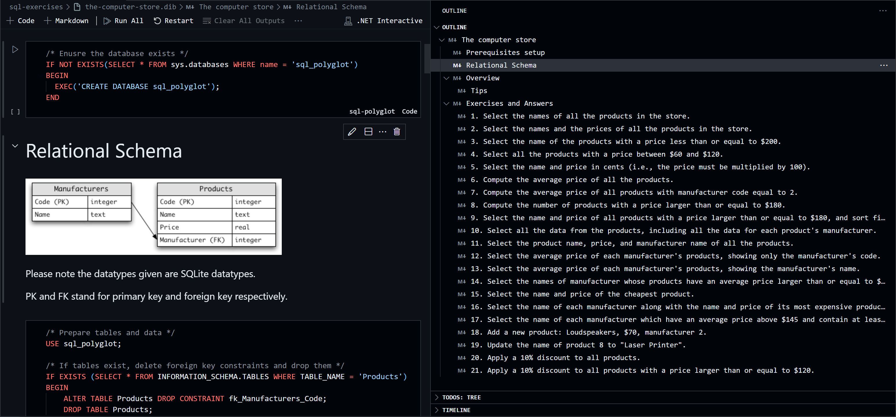

# SQL Polyglot Notebook




Interactive SQL notebook runs on [dotnet/interactive](https://github.com/dotnet/interactive) kernel.

View [Catalogs](catalogs.md) to see all available notebooks.

## How to use

Install the recommended extensions in VSCode.

> If you are using GitHub Codespaces, you can skip extension installation and Docker setup.

### Prepare Microsoft SQL Server

Run `docker compose up -d` to start  Microsoft SQL Server.

Use VSCode plugin to manage SQL Server `127.0.0.1,1433`, SA password is set in `docker-compose.yml`.

### Start SQL connection in Polyglot Notebook

In every `.dib` file, run the first two cell to connect to SQL kernel
(You will see cells like the following two blocks)

```cs
#r "nuget:Microsoft.DotNet.Interactive.SqlServer,*-*"
```

```cs
#!connect mssql --kernel-name polyglot "TrustServerCertificate=true; User ID=SA; Password=Password-123; Server=127.0.0.1,1433"
```

> You may also need to run the table creation cell in the notebook to create tables.

## Why Polyglot & SQL Server?

Jupyter works well with Python, but not so well with SQL plugins in VSCode,
I ran into issues rendering full wigdets with jupysql.

While on the other hand, SQL Server can work with Poyglot, and is good to manage with VSCode plugin.
I expect this repo can also work on GitHub Codespaces just as local VSCode,
so everything seems to be in place.

## License

Please note that the notebooks are under
MIT License for project structure and code &
CC BY-SA 4.0 license for the content of the notebooks.

See [LICENSE](LICENSE) for more details.
